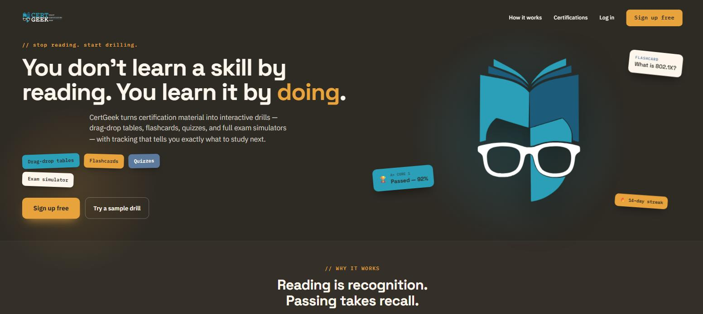
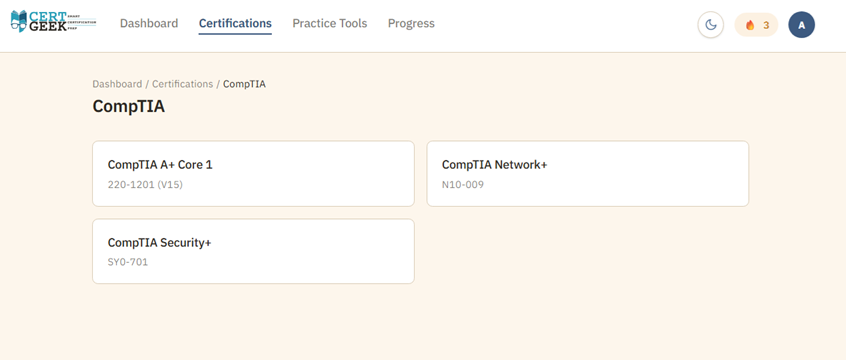
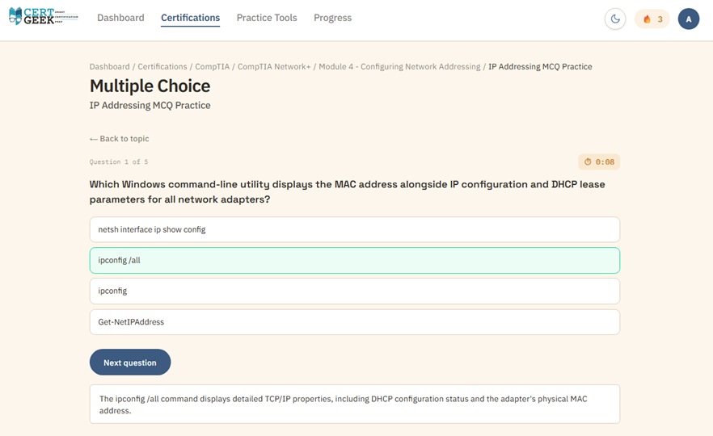
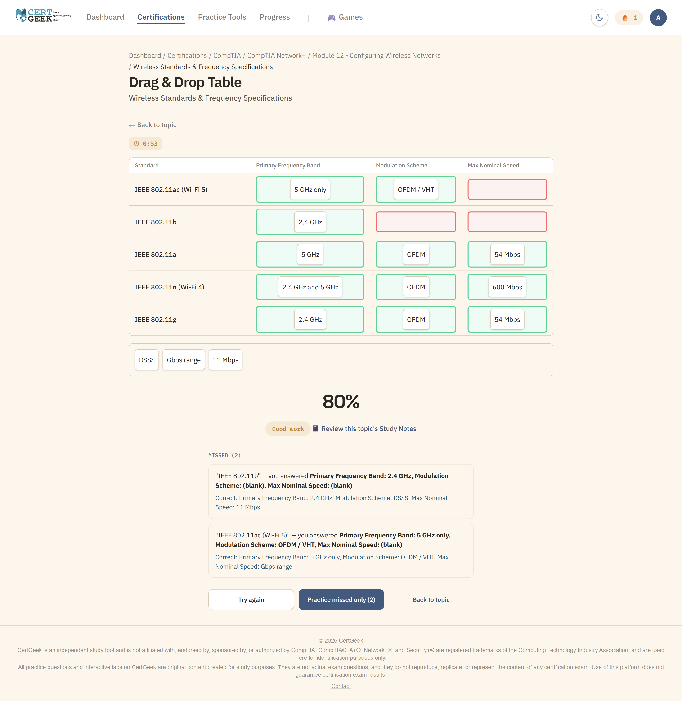
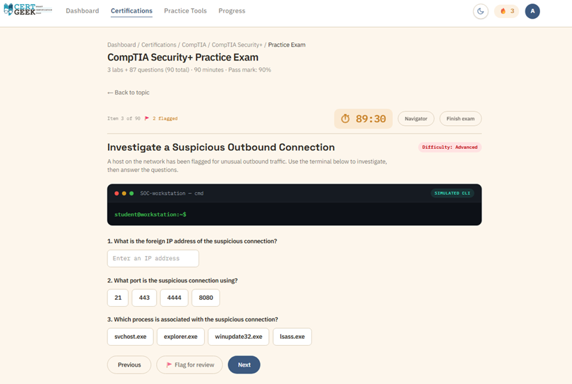
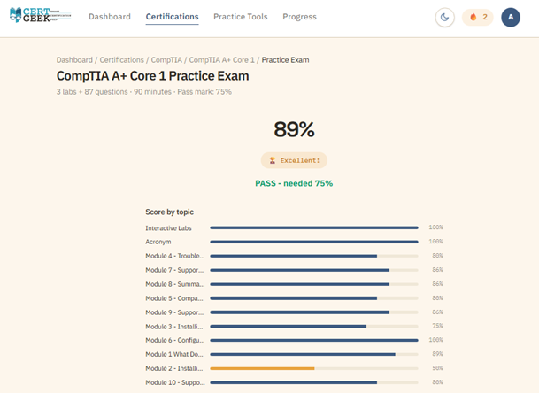
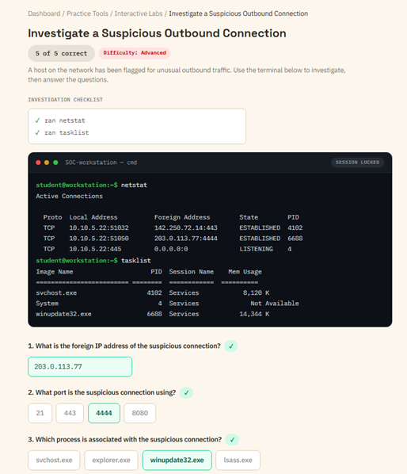
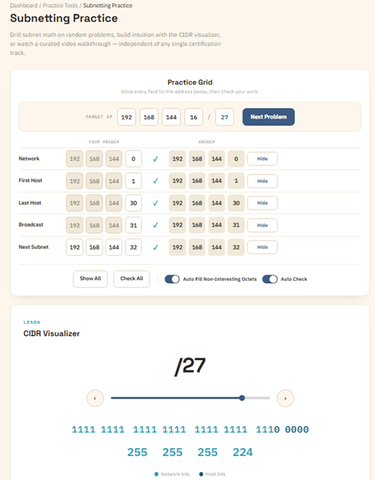
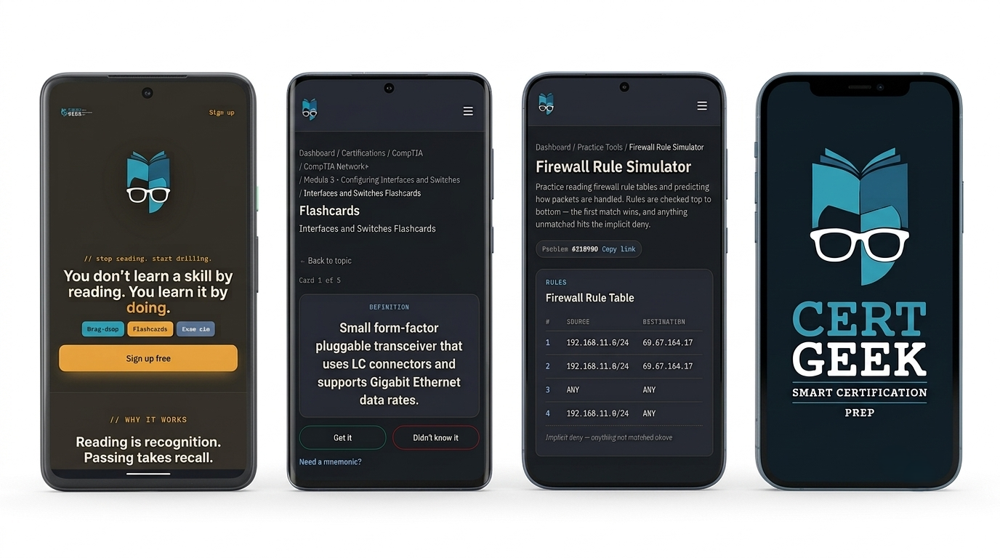

# CertGeek — Certification Exam Prep Platform

**A live, production web app for certification exam preparation.**
**CompTIA Network+ and Security+ complete — CompTIA A+ available now.**

### 🔗 [www.certgeek.net](https://www.certgeek.net)

`Next.js` · `React` · `TypeScript` · `Prisma` · `PostgreSQL` · `Auth.js` · `Tailwind CSS` · `Vercel`

<!-- SCREENSHOT 1: Landing page, above the fold -->

---

## About

CertGeek is a certification exam-prep platform I designed, built, and deployed solo. It's live and in active use.

The platform is **certification-agnostic by design** — it isn't built around a single exam body. New certifications are added as content rather than code, so the platform grows without being rewritten.

The goal was to close the gap between passive studying and the way certification exams actually test you. Most prep tools stop at flashcards and multiple choice. Real exams include performance-based questions — interactive, scenario-driven tasks — plus sustained time pressure across a long exam. CertGeek covers both: a question bank in multiple formats, hands-on practice tools, PBQ-style interactive labs, and a timed exam simulator.

All questions and labs are original content, written and reviewed for accuracy before publishing.

### Currently Live

| Certification | Exam | Status |
|---|---|---|
| CompTIA Network+ | N10-009 | Complete |
| CompTIA Security+ | SY0-701 | Complete |
| CompTIA A+ | Core 1 (220-1201) | Available — Core 2 (220-1202) in progress |

<!-- SCREENSHOT 2: Certifications page — A+, Network+, Security+ as three cards -->

---

## Features

### Practice Questions

Multiple question formats, so preparation isn't limited to recall:

- Multiple choice with explanations
- Fill-in-the-blank
- Flashcards
- Drag-and-drop table matching

<!-- SCREENSHOT 3: Multiple-choice question, correct answer selected, explanation revealed -->

<!-- SCREENSHOT 4: Drag-and-drop table, partially completed with correct/incorrect feedback -->

### Exam Simulator

A timed, 90-item practice exam that mirrors real test conditions — multiple-choice questions and PBQ-style labs under a single countdown — followed by a scored, per-topic breakdown of results.

<!-- SCREENSHOT 5: Exam in progress — timer, question counter, flagged items -->

<!-- SCREENSHOT 6: Score report with per-topic breakdown -->

### Interactive Labs

Eight types of hands-on, PBQ-style interactive labs for practicing the scenario-based tasks that appear on real certification exams — including scenario investigations with a simulated command-line environment.

<!-- SCREENSHOT 7: SOC investigation lab — simulated terminal + scenario questions, completed -->

  

### Free Practice Tools

Open-access utilities, no account required:

- **Subnetting practice** — generated problems with per-field answer checking and a CIDR visualizer
- **Binary / hex converter** — number system conversion drills
- **Firewall rule simulator** — practice reading rule tables and predicting how packets are handled

<!-- SCREENSHOT 8: Subnetting practice grid (solved) + CIDR visualizer -->

  

### Accounts & Progress

User authentication with saved progress across sessions and devices. Fully responsive — built to be used on a phone between shifts, not just at a desk.

<!-- SCREENSHOT 9: Mobile composite — landing, flashcards, firewall simulator -->

---

## Tech Stack

| Layer | Technology |
|---|---|
| Framework | Next.js (React, TypeScript) |
| Styling | Tailwind CSS |
| Database | PostgreSQL (Supabase) |
| ORM | Prisma |
| Authentication | Auth.js |
| Hosting | Vercel |

---

## Role

Solo developer. Product design, UI/UX, frontend, backend, database design, authentication, content, deployment, and ongoing maintenance.

<!-- OPTIONAL — only fill in with real numbers you can stand behind. Delete if you'd rather not publish metrics.
**By the numbers:** [X] practice questions · [X] interactive labs · live since [Month Year]
-->

---

## Source Code

CertGeek is a live product and its application repository is private.

This repository is a public showcase — overview, screenshots, and a link to the running app. The fastest way to evaluate the work is to [use it](https://www.certgeek.net). I'm glad to walk through the codebase and technical decisions directly in an interview.

---

## Disclaimer

CertGeek is an independent study tool and is not affiliated with, endorsed by, sponsored by, or authorized by CompTIA. CompTIA®, A+®, Network+®, and Security+® are registered trademarks of the Computing Technology Industry Association, and are used here for identification purposes only.

All practice questions and interactive labs on CertGeek are original content created for study purposes. They are not actual exam questions, and they do not reproduce, replicate, or represent the content of any certification exam. Use of this platform does not guarantee certification exam results.

---

## Contact

**GitHub:** [@agahazeeb](https://github.com/agahazeeb)

**LinkedIn:** (www.linkedin.com/in/agahazeeb)
