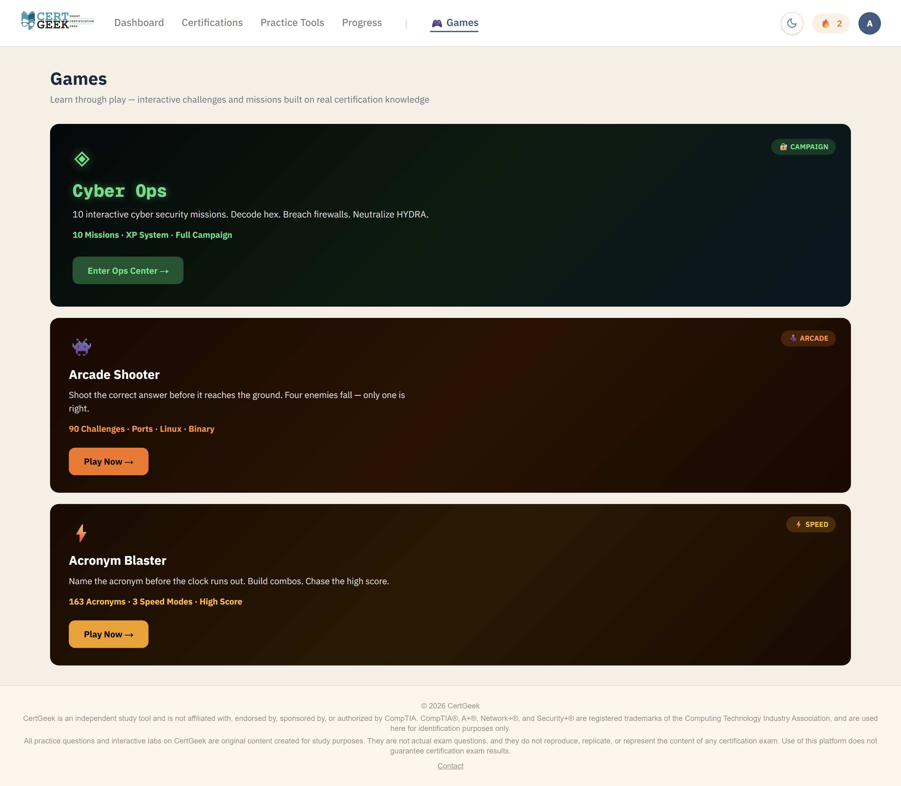
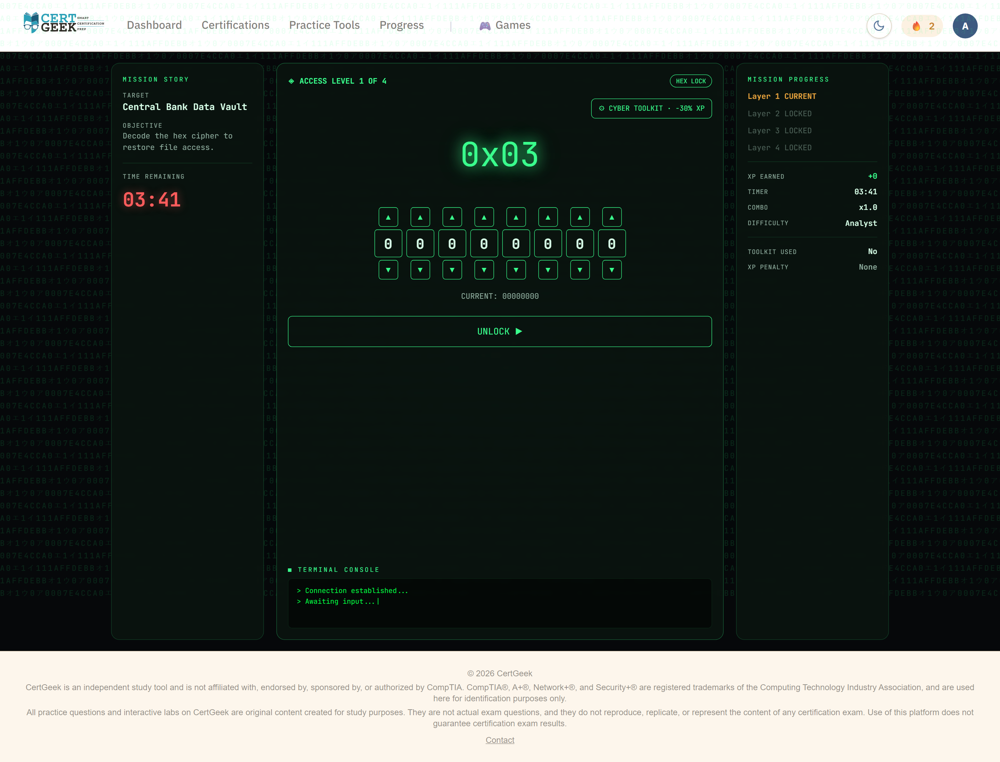
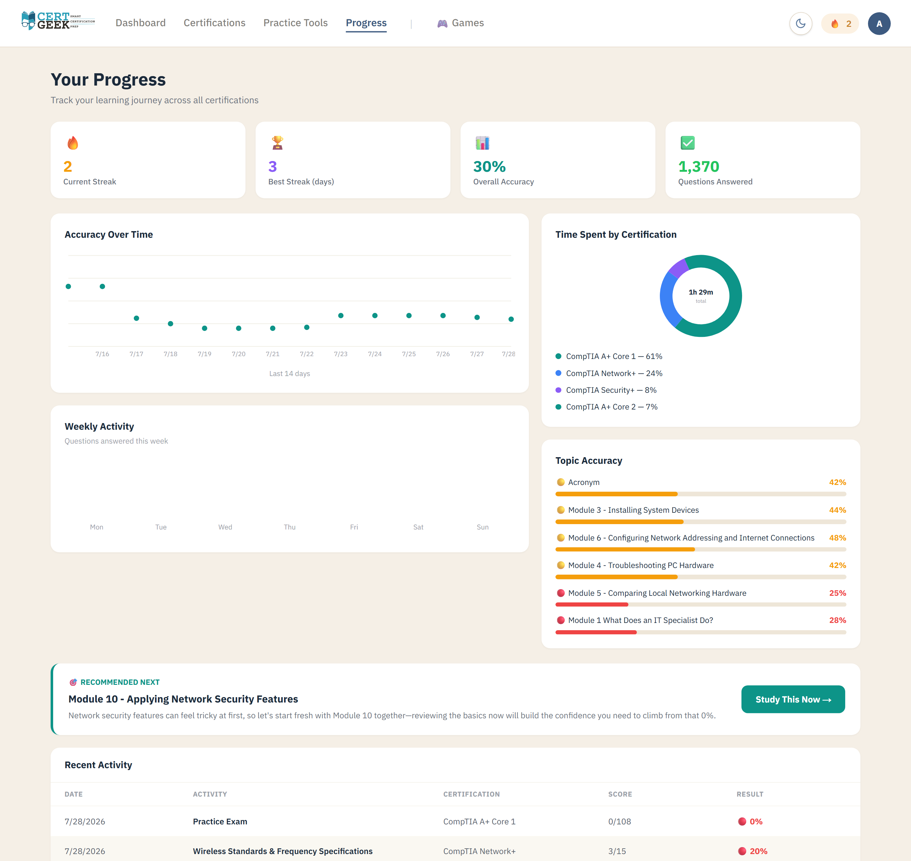

# CertGeek — Certification Exam Prep Platform

**A live, production web app for certification exam preparation — built solo, free to use.**

### 🔗 [www.certgeek.net](https://www.certgeek.net)

`Next.js` · `React` · `TypeScript` · `Prisma` · `PostgreSQL` · `Auth.js` · `Tailwind CSS` · `Vercel`

<!-- SCREENSHOT: Landing page hero -->

---

## About

CertGeek is a certification exam-prep platform I designed, built, and deployed solo. It's live, in active use, and under continuous development.

The platform is **certification-agnostic by design** — it isn't built around a single exam body. New certifications are added as content rather than code, so the platform grows without being rewritten.

The goal was to close the gap between passive studying and the way certification exams actually test you. Most prep tools stop at flashcards and multiple choice. Real exams include performance-based questions — interactive, scenario-driven tasks — plus sustained time pressure across a long exam. CertGeek covers both: 4,600+ practice questions in multiple formats, hands-on practice tools, eight types of PBQ-style interactive labs, a timed exam simulator, gamified learning, progress analytics, and a daily tech news feed.

All questions and labs are original content, written and reviewed for accuracy before publishing.

### Currently Live

| Certification | Exam | Status |
|---|---|---|
| CompTIA A+ | Core 1 (220-1201) | Complete |
| CompTIA A+ | Core 2 (220-1202) | Complete |
| CompTIA Network+ | N10-009 | Complete |
| CompTIA Security+ | SY0-701 | Complete |

CCNA is in development.

<!-- SCREENSHOT: Certifications page — all 4 CompTIA certs with progress + CCNA coming soon -->

---

## Features

### Practice Questions

Multiple question formats so preparation isn't limited to recall:

- Multiple choice with explanations
- Fill-in-the-blank
- Flashcards
- Drag-and-drop table matching with scored review and per-item feedback

<!-- SCREENSHOT: Security+ multiple-choice question with explanation revealed -->

<!-- SCREENSHOT: Wireless standards drag-drop table with 80% score and missed-item review -->

### Exam Simulator

A timed, 90-item practice exam that mirrors real test conditions — 87 multiple-choice questions and 3 PBQ-style labs under a single countdown, with question flagging — followed by a scored, per-topic breakdown of results.

<!-- SCREENSHOT: Exam in progress — subnetting PBQ lab, "3 labs + 87 questions" visible -->

<!-- SCREENSHOT: Score report with per-topic breakdown -->

### Practice Tools

Four hands-on tools under a shared hub, each deterministic and self-checking:

**Interactive Labs** — Eight types of PBQ-style interactive labs for practicing the scenario-based tasks that appear on real certification exams: ordering, matching, subnetting tables, firewall/ACL rule reordering, network diagram placement, log analysis, certificate chain ordering, and scripted terminal investigations with a simulated command-line environment.

<!-- SCREENSHOT: SOC investigation lab — simulated terminal, mid-task -->

  

**Subnetting Practice** — Generated problems with per-field answer checking, a CIDR visualizer that shows the network/host bit split, and curated video walkthroughs.

<!-- SCREENSHOT: Subnetting practice grid + CIDR visualizer + curated videos -->

  

**Binary & Hex Practice** — Byte-conversion drills with per-digit checking and an interactive bit builder (clickable place-value tiles with a live decimal/hex readout).

**Firewall Rule Simulator** — Practice reading firewall rule tables and predicting how packets are handled, with first-match-wins logic and a field-by-field explanation trace.

### Games

Three gamified learning modes under a dedicated Games section:

- **Cyber Ops** — A 10-mission cybersecurity campaign with a storyline, XP system, and progressive difficulty
- **Arcade Shooter** — 90 challenges across ports, Linux commands, and binary, with pixel-art visuals and a snap mechanic
- **Acronym Blaster** — 163 IT acronyms in a falling-arena speed drill with three difficulty modes (Chill, Normal, Blitz)

<!-- SCREENSHOT: Games hub — all three game cards -->

<!-- SCREENSHOT: Cyber Ops mission in action — hex lock puzzle with terminal console -->

### Progress & Analytics

A dedicated progress page with interactive charts (line, bar, donut), per-topic accuracy breakdowns with color-coded performance bars, weak-topic detection, a "Recommended Next" study prompt, recent activity history with scores, and streak tracking.

<!-- SCREENSHOT: Progress page — charts, topic accuracy, recommended next -->

### Dark Mode & Mobile

Full dark mode toggle that persists across sessions. Fully responsive — built to be used on a phone between shifts, not just at a desk.

<!-- SCREENSHOT: Mobile composite — landing, flashcards, firewall simulator -->

---

## Tech Stack

| Layer | Technology |
|---|---|
| Framework | Next.js (React, TypeScript) |
| Styling | Tailwind CSS |
| Database | PostgreSQL (Supabase) |
| ORM | Prisma |
| Authentication | Auth.js |
| Hosting | Vercel |

---

## Role

Solo developer. Product design, UI/UX, frontend, backend, database design, authentication, security, content, testing, deployment, and ongoing maintenance.

**By the numbers:** 4,600+ practice questions · 8 interactive lab types · 3 games · 4 published certifications · 872 passing tests

---

## Source Code

CertGeek is a live product and its application repository is private.

This repository is a public showcase — overview, screenshots, and a link to the running app. The fastest way to evaluate the work is to [use it](https://www.certgeek.net).

---

## Disclaimer

CertGeek is an independent study tool and is not affiliated with, endorsed by, sponsored by, or authorized by CompTIA or Cisco. CompTIA®, A+®, Network+®, and Security+® are registered trademarks of the Computing Technology Industry Association. Cisco® and CCNA® are trademarks of Cisco Systems, Inc. All trademarks are used here for identification purposes only.

All practice questions and interactive labs on CertGeek are original content created for study purposes. They are not actual exam questions, and they do not reproduce, replicate, or represent the content of any certification exam. Use of this platform does not guarantee certification exam results.

---

## Contact

**GitHub:** [@agahazeeb](https://github.com/agahazeeb)
- **LinkedIn:** (www.linkedin.com/in/agahazeeb)
